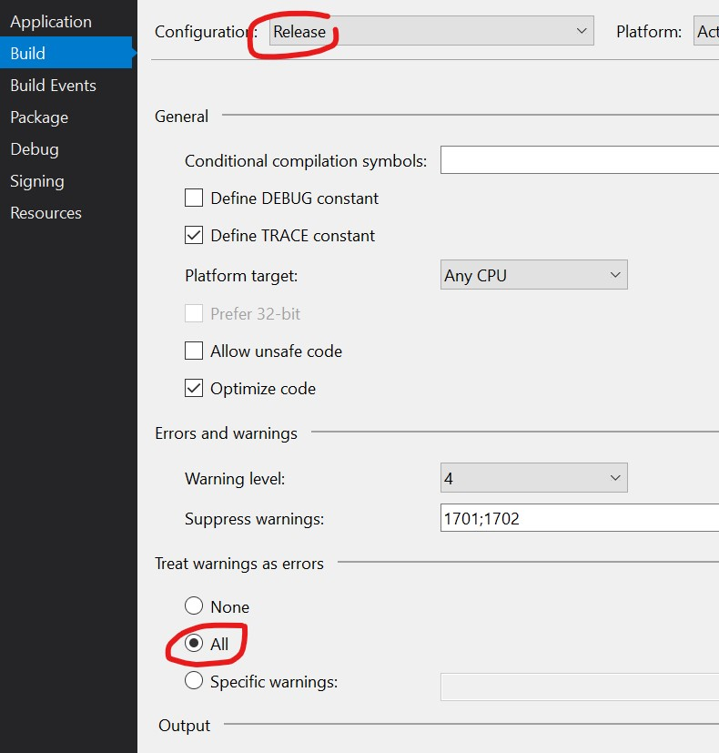
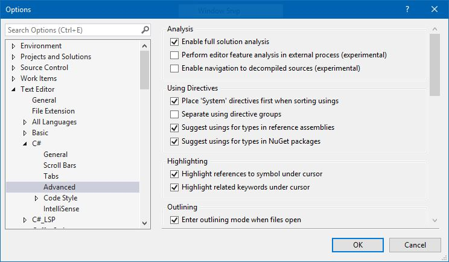

# PROJECT SETTINGS AND STRUCTURE

1. HMS is using .NET Core version `2.2.102`. Make sure you have correct version:
- Run `dotnet --list-sdks` to see all .NET Core installed version.

- Choose correct version in Project options.

2. Always build your project with warning level 4.

3. Treat warnings as errors in the Release build (note that this is not the default ofVisual Studio). Although it is optional, this standard recommends treating warningsas errors in Debug builds as well.

4. Avoid suppressing specific compiler warnings.

5. Avoid explicit preprocessor definitions `#define`. Use the project settings for defining conditional compilation constants.

6. All assembly references in the same solution should use relative paths.

7. Disallow cyclic references between assemblies.
> **IMPORTANT**

8. Avoid multi-module assemblies.

9. Strive to use uniform version numbers on all assemblies and clients in the same logical application (typically a solution).
> See the SolutionInfo.cs technique from Chapter 5 of Programming .NET Components 2nd Edition to automate.

10. Name your application configuration file as `appsettings.json`, and include it in the project. Use `appsettings.{environment}.json` for each environment per se.
> **DO NOT** add `appsettings.{environment}.json` to VSC, but the solution should be able to run with/without it.

11. Configure the **Using Directives** as

